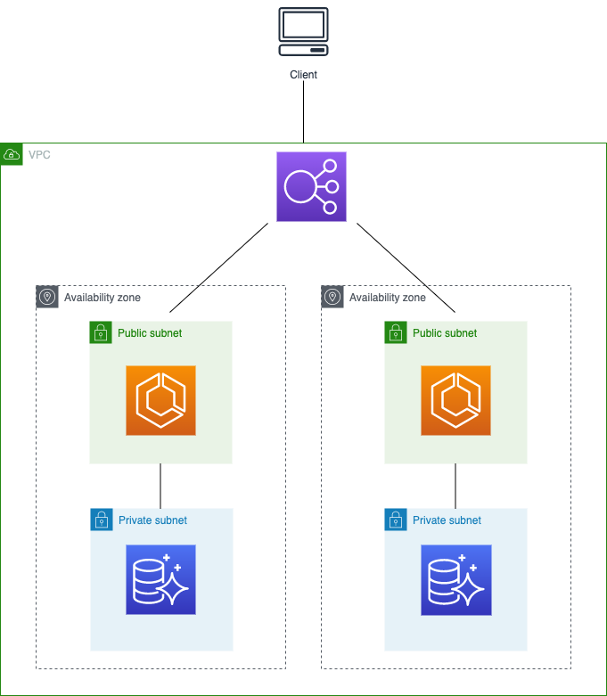

# Simple-WordPress-Site

I created a VPC with public and private subnets. I have also attached an internet gateway to a new route table and associated this route table with the public subnets. The private subnets are associated with the default VPC route table.

For ECS, I used Fargate for this demonstration. I created a task definition that pulls the WordPress image from Dockerhub, exposing the necessary port and allocates the CPU and memory for the container. Before creating my service definition, I created an application load balancer that will listen on port 80 with a designated target group. The service definition connects the ALB with my task definition, allowing the ALB DNS name to point to the containers. The ECS security group allows inbound traffic from the ALB security group, while the ALB security group allows HTTP port 80 inbound traffic. 

For RDS, I choose Aurora Serverless because you pay for only what you consume and the auto-pause feature helps keep my account in the free tier. I created a security group that allows inbound traffic to my ECS security group.

The Terraform module will output the RDS endpoint and ALB DNS name, so you don't have to rummage through the console.

